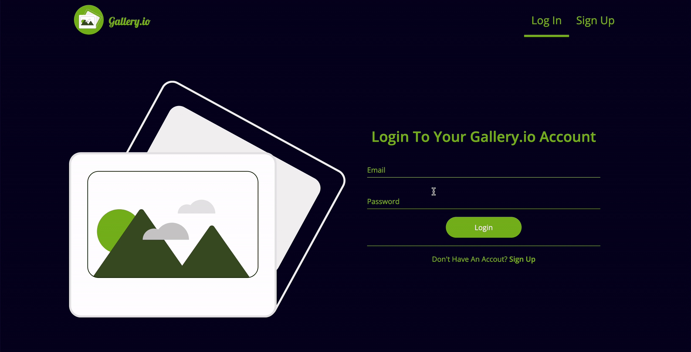

# gallery.io

> Please excuse the quality of the videos, something must have gone wrong in the video conversion process :/

## Login, Security Features

- Login

- Register
- Logout
- Auth using JWT and Cookies

## Upload Image

- **Secure** image upload to the file directory

- File type validated before upload for security reasons.
- Image size can be a maximum of 5MB.
- Image has description & tags.

## Delete

- Image Deletion

- Images can only be deleted by the creator of the image

## View  Images

- Only logged in users can view images

- View pictures uploaded by a user

- **Search** for images by tags.

## Comments / Reviews

- Users can not leave ratings/comments on their own image.
- Aggregate all ratings on a picture to get total rating.
- Filter out vulgar language in the comments.

## Dashboard

- Loads pictures by created time
- Search by tags
- Pagination, filtering 